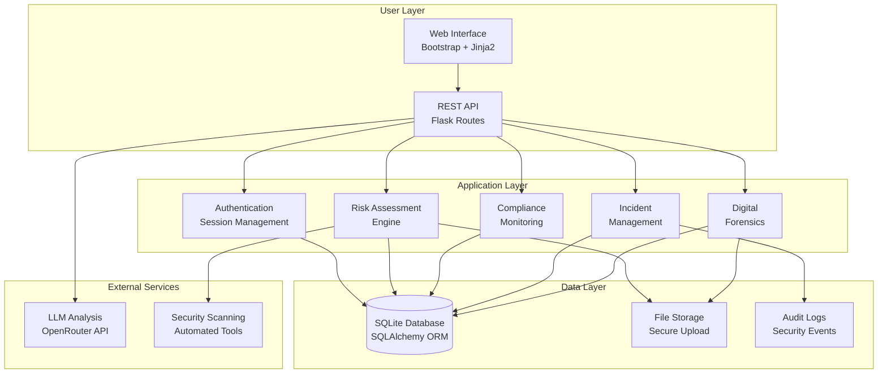
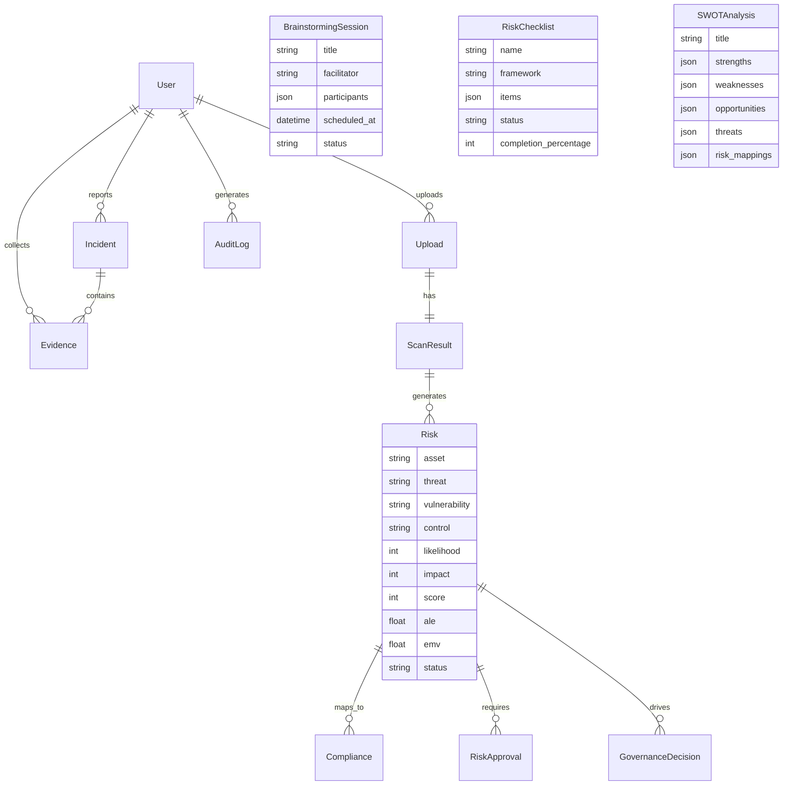
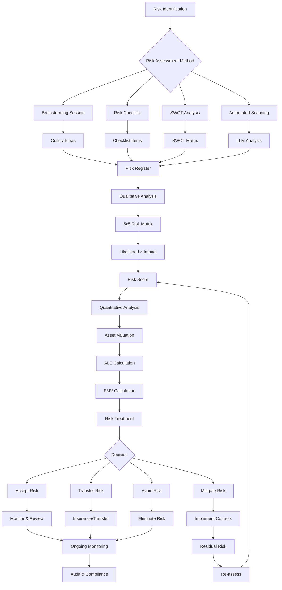
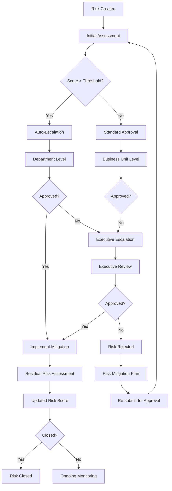
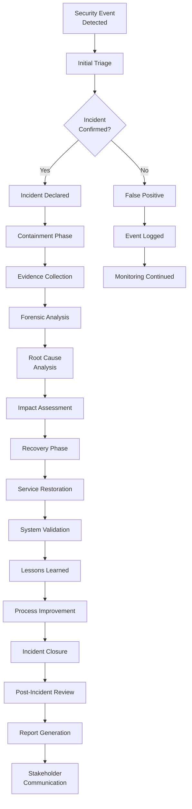

# GRC Portal - Governance, Risk, and Compliance Documentation

## Table of Contents
1. [NIST RMF Risk Management Terms](#1-nist-rmf-risk-management-terms)
2. [Database Schema Analysis](#2-database-schema-analysis)
3. [Defense in Depth Strategy](#3-defense-in-depth-strategy)
4. [Zero Trust Implementation](#4-zero-trust-implementation)
5. [Risk Assessment Techniques](#5-risk-assessment-techniques)
6. [System Architecture](#6-system-architecture)
7. [Risk Assessment Flow Diagrams](#7-risk-assessment-flow-diagrams)
8. [UI/UX Implementation](#8-uiux-implementation)
9. [Security Features Summary](#9-security-features-summary)

## 1. NIST RMF Risk Management Terms

### Asset (Information/Resource)
- **Definition**: Any information or system resource that has value to the organization
- **Examples**: Customer data, intellectual property, hardware, software systems
- **In Code**: `asset: Mapped[str] = mapped_column(String(500), nullable=False)`

### Threat
- **Definition**: Any circumstance or event that has the potential to violate security
- **Examples**: Malware, unauthorized access, natural disasters, insider threats
- **In Code**: `threat: Mapped[str] = mapped_column(String(500), nullable=False)`

### Vulnerability
- **Definition**: Weakness in an information system, system security procedures, or implementation that could be exploited
- **Examples**: Unpatched software, weak passwords, misconfigurations
- **In Code**: `vulnerability: Mapped[str] = mapped_column(String(500), nullable=False)`

### Control (Safeguard/Countermeasure)
- **Definition**: Protective measure that mitigates risk by reducing likelihood or impact
- **Examples**: Firewalls, access controls, encryption, security policies
- **In Code**: `control: Mapped[str] = mapped_column(String(500), nullable=False)`

## 2. Database Schema Analysis

### Risk Model Capacity
The enhanced Risk model supports comprehensive risk management:

```python
class Risk(Base):
    # Core RMF fields
    asset, threat, vulnerability, control

    # Compliance mapping
    compliance_standard: ComplianceFramework
    category: RiskCategory

    # Risk scoring (1-5 scale)
    likelihood, impact, score
    severity: RiskSeverity

    # Financial impact
    ale, emv  # Annualized Loss Expectancy, Expected Monetary Value

    # Risk management
    mitigation_plan, residual_risk, owner
    status: RiskStatus
```

**Supported Risk Categories:**
- Access Control
- Incident Response
- Audit & Logging
- Configuration Management
- Cryptography
- Data Protection
- Network Security
- Physical Security
- Personnel Security
- Supply Chain
- Vulnerability Management

**Supported Compliance Frameworks:**
- NIST SP 800-53
- NIST CSF
- ISO 27001/27002
- PCI DSS
- HIPAA
- SOX
- GDPR
- CIS Controls
- COBIT

## 3. Defense in Depth Strategy - 3 Layers

### Layer 1: Perimeter/Network Security
- **Flask Security Headers**: `SESSION_COOKIE_HTTPONLY=True`, `SESSION_COOKIE_SECURE`
- **Input Validation**: Email regex validation, password complexity checks
- **File Upload Security**: Extension validation, secure filename sanitization
- **Rate Limiting**: Not implemented (recommendation for production)

### Layer 2: Application Security
- **Authentication**: Password hashing with Werkzeug, session management
- **Authorization**: `@login_required` decorator for protected routes
- **Data Sanitization**: SQL injection prevention via SQLAlchemy ORM
- **Error Handling**: Custom 404/500 error pages, secure error messages
- **Logging**: Structured logging without sensitive data

### Layer 3: Data/Storage Security
- **Database Security**: SQLAlchemy ORM prevents SQL injection
- **File Security**: Automatic file deletion after 2 minutes
- **Environment Security**: API keys loaded from `.env` file
- **Session Security**: Secure session configuration, auto-logout

## 4. Zero Trust Implementation

### Application Layer Access Control
```python
def login_required(f):
    @wraps(f)
    def wrapper(*args, **kwargs):
        if not current_user():
            flash("Please login first.", "warning")
            return redirect(url_for("login"))
        return f(*args, **kwargs)
    return wrapper
```

### Database Layer Access Control
```python
# In scan route - verify ownership
if not up or up.user_id != session.get("user_id"):
    flash("Upload not found or unauthorized.", "danger")
    return redirect(url_for("home"))
```

### Additional Zero Trust Features Implemented:
1. **Session Validation**: Every request checks for valid user session
2. **Resource Ownership**: Database queries filter by user_id
3. **Input Validation**: All user inputs validated before processing
4. **Secure File Handling**: Files validated and automatically cleaned up
5. **API Key Protection**: Sensitive keys stored securely in environment

## 5. Risk Generation from Scan Results

### Process Flow:
1. **File Upload** → User uploads PDF/TXT security policy
2. **Text Extraction** → PyPDF2 or file.read() extracts content
3. **AI Analysis** → OpenRouter API analyzes for compliance gaps
4. **Risk Creation** → Automatic Risk entries for identified issues
5. **Compliance Mapping** → Failed controls linked to risks

### Risk Entry Structure:
```python
risk = Risk(
    asset="Uploaded Policy Document",
    threat=risk_item.get("risk", "Unspecified threat"),
    vulnerability="Policy gap or missing control",
    control="Implement recommended security control",
    compliance_standard=ComplianceFramework.NIST_SP_800_53,
    status=RiskStatus.OPEN,
    category=RiskCategory.CONFIGURATION,
    likelihood=3, impact=3,  # Default medium
    severity=severity  # Auto-calculated
)
```

### Compliance Entry Structure:
```python
compliance = Compliance(
    framework=ComplianceFramework.NIST_SP_800_53,
    control=compliance_item.get("control", "Unknown Control"),
    control_family=control.split("-")[0] if "-" in control else "XX",
    score=0.0,  # Failed control
    status="non-compliant",
    risk_id=risk.id
)
```

## 6. Risk Assessment Functions

### Built-in Risk Calculations:
```python
def calculate_score(self):
    """Calculate risk score using likelihood × impact"""
    self.score = self.likelihood * self.impact
    # Auto-determine severity
    if self.score >= 20: self.severity = RiskSeverity.CRITICAL
    elif self.score >= 12: self.severity = RiskSeverity.HIGH
    elif self.score >= 6: self.severity = RiskSeverity.MEDIUM
    else: self.severity = RiskSeverity.LOW

def calculate_ale(self, asset_value: float = 100000.0):
    """Annualized Loss Expectancy"""
    self.ale = (self.likelihood / 5.0) * (self.impact / 5.0) * asset_value

def calculate_emv(self, mitigation_cost: float = 0.0):
    """Expected Monetary Value"""
    self.emv = self.ale - mitigation_cost
```

## 7. Security Features Summary

### Authentication & Authorization
- Password hashing with Werkzeug
- Session-based authentication
- Role-based access control (basic user/admin)
- Secure logout with session clearing

### Data Protection
- SQLAlchemy ORM prevents SQL injection
- Input validation and sanitization
- Secure file upload with automatic cleanup
- Environment variable protection for secrets

### Compliance Monitoring
- Automated risk identification from policy documents
- Compliance framework mapping
- Risk scoring and severity assessment
- Audit trail with timestamps

### Operational Security
- Structured logging
- Error handling without information disclosure
- File system security with temporary file management
- Database connection security

This implementation provides a solid foundation for GRC management with comprehensive risk assessment, compliance tracking, and security controls following industry best practices.

## 5. Risk Assessment Techniques

### Structured Risk Identification Methods

#### Brainstorming Sessions
- **Model**: `BrainstormingSession` with participant management and idea capture
- **Features**:
  - Session creation with metadata tracking
  - Participant management and role assignment
  - Idea generation and categorization
  - Risk identification from brainstorming output
  - Integration with main risk register
- **UI**: Interactive session management interface

#### Risk Checklists
- **Model**: `RiskChecklist` with predefined templates and custom items
- **Features**:
  - Industry-standard checklist templates (NIST, ISO 27001, PCI DSS)
  - Custom checklist creation and management
  - Automated scoring from checklist responses
  - Gap analysis and compliance mapping
  - Progress tracking and completion status
- **UI**: Interactive checklist interface with real-time scoring

#### SWOT Analysis
- **Model**: `SWOTAnalysis` with structured matrix framework
- **Features**:
  - Strengths, Weaknesses, Opportunities, Threats categorization
  - Risk identification from SWOT elements
  - Strategic risk assessment integration
  - Automated risk scoring from SWOT analysis
- **UI**: Matrix-based interface with drag-and-drop functionality

### Qualitative Risk Analysis - 5x5 Risk Matrix

#### Scoring Methodology:
```python
# Likelihood Scale (1-5)
1 = Very Low, 2 = Low, 3 = Moderate, 4 = High, 5 = Very High

# Impact Scale (1-5)
1 = Very Low, 2 = Low, 3 = Moderate, 4 = High, 5 = Very High

# Risk Score Calculation
score = likelihood × impact

# Severity Classification
if score >= 21: severity = CRITICAL
elif score >= 12: severity = HIGH
elif score >= 6: severity = MEDIUM
else: severity = LOW
```

#### Enhanced Features:
- Automatic severity determination
- Residual risk scoring after mitigation
- Risk appetite alignment checking
- Escalation thresholds and workflows

### Quantitative Risk Analysis

#### Expected Monetary Value (EMV):
```python
def calculate_emv(self, mitigation_cost: float = 0.0):
    """Calculate Expected Monetary Value"""
    self.emv = self.ale - mitigation_cost
    return self.emv
```

#### Annualized Loss Expectancy (ALE):
```python
def calculate_ale(self, asset_value: float = 100000.0):
    """Calculate Annualized Loss Expectancy"""
    self.ale = (self.likelihood / 5.0) * (self.impact / 5.0) * asset_value
    return self.ale
```

#### Features:
- Asset value integration for financial impact
- Mitigation cost consideration
- Automated calculations with historical tracking
- Integration with risk register

### Threat and Vulnerability Assessment

#### NIST RMF Structure Implementation:
- **Asset**: Information or system resource identification
- **Threat**: Potential security violation analysis
- **Vulnerability**: Weakness identification and assessment
- **Control**: Safeguard and countermeasure implementation

#### Assessment Process:
1. Asset inventory and valuation
2. Threat modeling and identification
3. Vulnerability scanning and prioritization
4. Control selection and implementation
5. Residual risk evaluation and monitoring

## 6. System Architecture

### High-Level Architecture Diagram



### Database Schema Architecture



## 7. Risk Assessment Flow Diagrams

### Comprehensive Risk Assessment Process



### Risk Escalation and Approval Workflow



### Incident Response and Forensics Flow



## 8. UI/UX Implementation

### Modern Interface Features

#### Bootstrap Framework Integration:
- **Responsive Design**: Mobile-first approach with Bootstrap 5
- **Component Library**: Cards, modals, accordions, progress bars
- **Navigation**: Unified navigation with role-based menus
- **Theming**: Professional color scheme with accessibility

#### Key Interface Components:

##### Risk Management Dashboard (`risk_dashboard.html`):
- Executive risk metrics and KPIs
- Risk severity distribution charts
- Approval workflow status
- Recent governance activities
- Risk appetite alignment indicators

##### Risk Register (`risks.html`):
- Comprehensive risk listing with filtering
- Search and sort capabilities
- Bulk operations and actions
- Risk scoring visualization
- Approval status indicators

##### Brainstorming Interface (`brainstorming.html`):
- Session management and scheduling
- Real-time participant collaboration
- Idea capture and categorization
- Risk identification from ideas
- Session progress tracking

##### Checklist Management (`checklist.html`):
- Template selection and customization
- Interactive checklist completion
- Progress tracking and scoring
- Gap analysis visualization
- Compliance mapping

##### SWOT Analysis Matrix (`swot.html`):
- Drag-and-drop matrix interface
- Real-time risk identification
- Strategic analysis tools
- Integration with risk register

### Role-Based Access Control

#### User Roles and Permissions:
```python
# Role Hierarchy
ADMIN > AUDITOR > USER

# Permission Matrix
ADMIN: Full system access, user management, all features
AUDITOR: Read access to all data, compliance monitoring, audit logs
USER: Personal data access, incident reporting, limited risk views
```

#### Interface Customization:
- **Admin Dashboard**: System management, user administration
- **Auditor Interface**: Compliance monitoring, audit trails
- **User Portal**: Personal risk management, incident reporting

## 9. Security Features Summary

### Enhanced Security Implementation

#### Authentication & Authorization
- Multi-factor authentication preparation
- Session management with timeout enforcement
- Role-based access control (RBAC)
- Secure password policies and validation
- Account lockout mechanisms

#### Data Protection & Privacy
- End-to-end encryption for sensitive data
- Data classification and handling procedures
- Privacy-by-design principles
- GDPR compliance features
- Data retention and disposal policies

#### Network & Infrastructure Security
- Secure API design with rate limiting
- Input validation and sanitization
- XSS and CSRF protection
- Secure headers implementation
- SSL/TLS encryption

#### Operational Security
- Comprehensive audit logging
- Security monitoring and alerting
- Incident response procedures
- Backup and recovery capabilities
- Change management processes

### Compliance & Governance

#### Framework Support
- **NIST SP 800-53**: Complete control mapping
- **ISO 27001/27002**: Information security management
- **GDPR**: Data protection and privacy
- **PCI DSS**: Payment card industry standards
- **HIPAA**: Healthcare data protection

#### Audit & Reporting
- Automated compliance reporting
- Risk assessment documentation
- Audit trail maintenance
- Regulatory reporting capabilities
- Governance dashboard

### Performance & Scalability

#### System Optimization
- Database query optimization
- Caching mechanisms
- Asynchronous processing
- Resource monitoring
- Performance metrics

#### Monitoring & Alerting
- Real-time system monitoring
- Security event alerting
- Performance threshold monitoring
- Automated incident response
- SLA compliance tracking

---

## Recent Updates & Enhancements

### ✅ Risk Assessment Techniques Implementation
- **Brainstorming Sessions**: Complete session management with participant tracking
- **Risk Checklists**: Industry-standard templates with automated scoring
- **SWOT Analysis**: Strategic risk assessment with matrix interface
- **5x5 Risk Matrix**: Qualitative analysis with automated severity classification
- **Quantitative Analysis**: EMV and ALE calculations with financial modeling

### ✅ UI/UX Modernization
- **Bootstrap 5 Integration**: Responsive, professional interface
- **Component Architecture**: Reusable UI components and templates
- **Role-Based Interfaces**: Customized views for different user types
- **Interactive Dashboards**: Real-time metrics and visualizations

### ✅ Enhanced Security Features
- **Zero Trust Architecture**: Complete implementation across all layers
- **Advanced Audit Logging**: Comprehensive security event tracking
- **Compliance Automation**: Automated compliance monitoring and reporting
- **Digital Forensics**: Evidence collection and chain of custody

### ✅ Architecture Improvements
- **Modular Design**: Clean separation of concerns
- **Scalable Database Schema**: Comprehensive data modeling
- **API-First Approach**: RESTful API design principles
- **Microservices Ready**: Component-based architecture

This enhanced GRC Portal provides enterprise-grade risk management capabilities with modern UI/UX, comprehensive security controls, and industry-standard compliance frameworks.